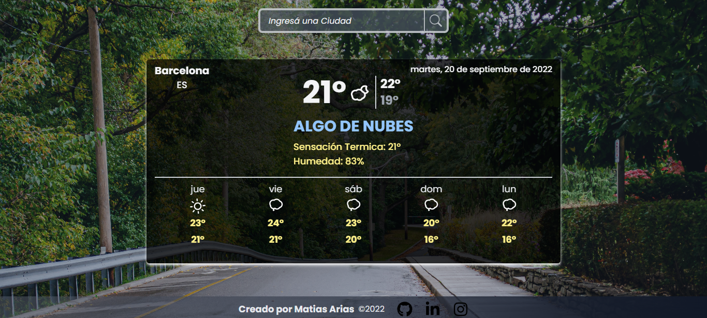

# The Weather app

A weather app built with React, JavaScript, Tailwind, React-hooks, Luxon. I used three APIs for the data. for the dinamic backgrounds images i used the unsplash API and for the weather data i used two open weather map APIs

## Link

Deploy Site: [https://the-world-weather-app.vercel.app/](https://the-world-weather-app.vercel.app/)

## Screenshots

---

## Api

for the data requests i used three APIs [https://unsplash.com/developers](https://unsplash.com/developers)
[https://openweathermap.org/current](https://openweathermap.org/current)
[https://openweathermap.org/api/one-call-3](https://openweathermap.org/api/one-call-3)

## Built with

- React
- Javascript
- Tailwind
- react hooks
- react icons
- luxon.js
- react-animated-weather-icons
- lottie react
